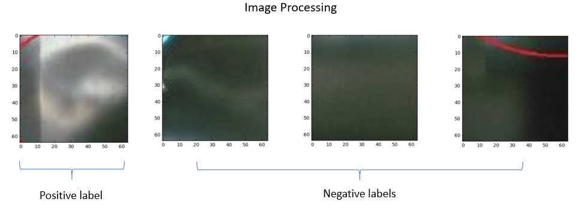
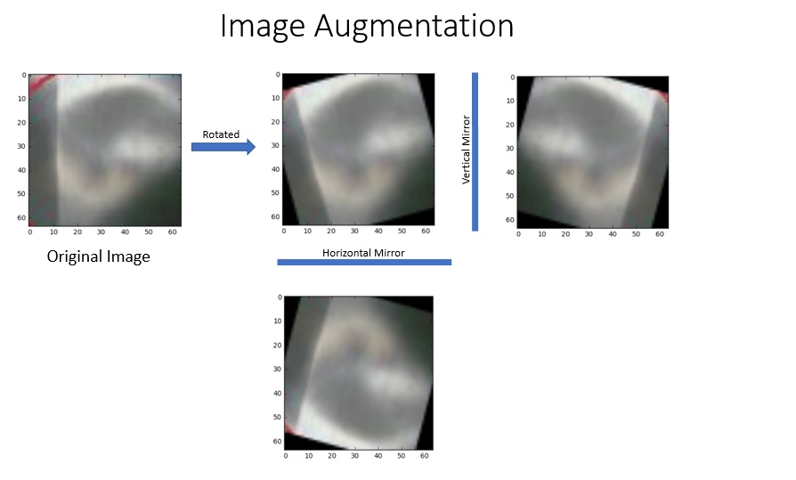
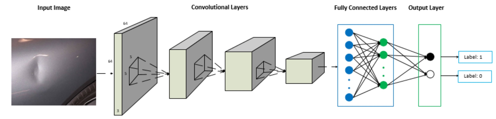
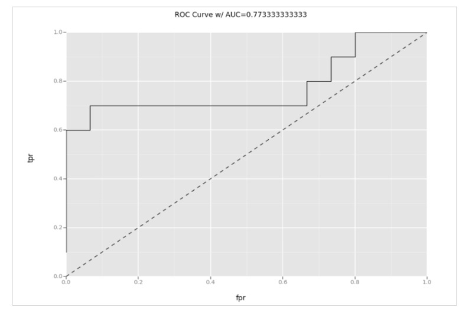
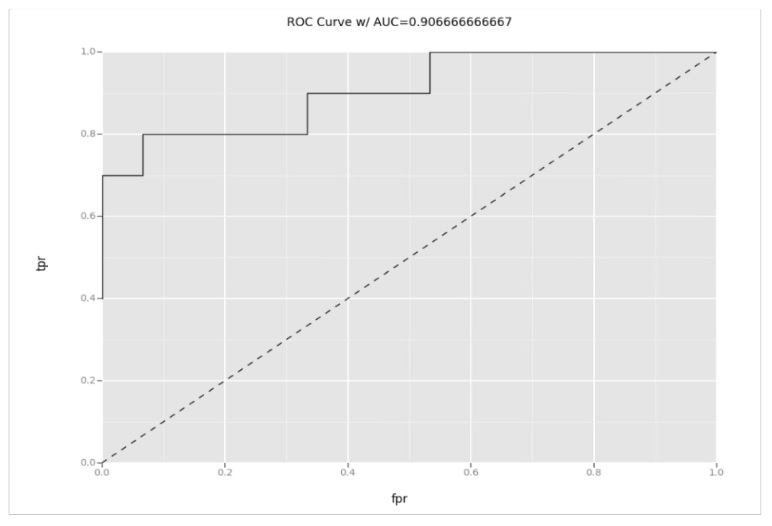

# Image Classification with Microsoft AI Platform [中文](README.md)

In the following, we will go through each step with detailed instructions to illustrate the end to end solution development process.
## Step 0: Prepare the Azure DSVM
Suggest to refer *TrainingDSVM* in *Deploy* to create a DSVM and prepare this solution.

In the [Azure Portal](https://portal.azure.cn), begin provisioning a new Windows 2016 DSVM. 

## Step 1: Data Prepareation
Image classification is the same as the common classificaiton problem. First we need label the data. We mark the center of the dents in the images. Hence we have an *Train* folder contains original image while together with a *Train_dotted* folder with images marked. Refer *Data/Images*  in this repo to see sample images.

Based on these datasets, we write code to cut off the 64X64 around the center of the mark. This one will be labeld as '1'. For the rest of the images, we will cut 64X64 images randomly and label them as '0'. All these cutted images will be the input data with label. The following picture showed some examples after this process:

## Step 2: Data Augmentation
Even with the image processed as before, still we have too few images for training (< 100). We need expand our dataset for a better model. Data Augmentation can always improve performance though the amount depends on the dataset. If you want to augmented the data to artificially increase the size of the dataset you can do the following if the case applies (it wouldn't apply if for example were images of houses or people where if you rotate them 180 degrees they would lose all information but not if you flip them like a mirror does):

- rotation: random with angle between 0° and 360° (uniform)
- translation: random with shift between -10 and 10 pixels (uniform)
- rescaling: random with scale factor between 1/1.6 and 1.6 (log-uniform)
- flipping: yes or no (bernoulli)
- shearing: random with angle between -20° and 20° (uniform)
- stretching: random with stretch factor between 1/1.3 and 1.3 (log-uniform)
- mirroring: get the mirror of the original image

In our approach, we will rotate each images in every 15 degree, and then take the mirror of each image in horizontal and vertical directions. So for each image, we will generate 24 (rotated including the original one) * 2 (mirrored) = 48 images. The following picture illustrates the processing:

## Step 3.1: Build model from scratch
We will use the Keras as example to show the model building process. Keras supports both CNTK and Tensorflow as the backend.
The problem we try to solve is verify whether there is a dent in the given image, which is a simply binary classification problem. Here we build a feed-forward convolutional neural network (CNN), which performs quite well for this kind of classification problem. The following picture illustrates the workflow of the training process.

## Step 3.2: Transfer Learning
Given the small number of images we have, instead of training the model from the scratch, we may take advantage of pre-trained model. In general, the most important factors to decide how to perform transfer learning are the size of the new dataset (small or large) and the similarity with the original dataset. For our case, we will use the pre-trained mode with VGG as example to demonstrate the usage of transfer learning. Since the dataset is small, we will only train a linear classifier. Because the dataset is very different compared with the ImageNet images, we will train a classifier from activations somewhere earlier in the VGG network.  
 
VGG is a deep convolutional network for object recognition developed and trained by Oxford's renowned Visual Geometry Group (VGG). They achieved very good performance on the ImageNet dataset on ILSVRC 2014. 

## Step 4: Model Performance Evaluation
We randomly chose 11 images for model performance evaluation purpose. With the image augmentation, we will have 25 test images of size 64 X 64, 11 with positive labels and 14 with negative ones.
For the model trained from the scratch, the performance metrics is as following:
 &nbsp;&nbsp;&nbsp;<b>Precision:</b>  1.0
 &nbsp;&nbsp;&nbsp;<b>Recall &nbsp;&nbsp;&nbsp;&nbsp;&nbsp;:</b> 0.6
 &nbsp;&nbsp;&nbsp;<b>F1 score :</b> 0.75
 &nbsp;&nbsp;&nbsp;<b>AUC &nbsp;&nbsp;&nbsp;&nbsp;&nbsp;&nbsp;&nbsp;&nbsp;:</b> 0.77

The ROC curve is as following:

 

 The performance metrics for VGG16 transfer learning is as following:
 &nbsp;&nbsp;&nbsp;<b>Precision:</b>  1.0
 &nbsp;&nbsp;&nbsp;<b>Recall &nbsp;&nbsp;&nbsp;&nbsp;&nbsp;:</b> 0.6
 &nbsp;&nbsp;&nbsp;<b>F1 score :</b> 0.75
 &nbsp;&nbsp;&nbsp;<b>AUC &nbsp;&nbsp;&nbsp;&nbsp;&nbsp;&nbsp;&nbsp;&nbsp;:</b> 0.91

The ROC curve is as following:

 

With the transfer learning, it will get the better performance with relatively small amount of training images.

## Step 5: Model deployment and scoring
We use Azure Webapp to host this model as a web service.
Please check *PredictWebApps* in *Deploy* for how to deploy model and score during web service.
