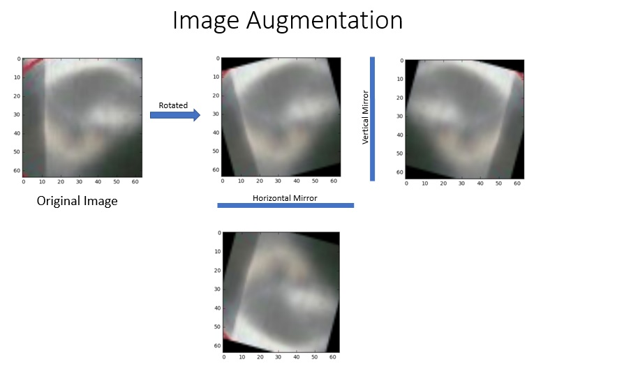
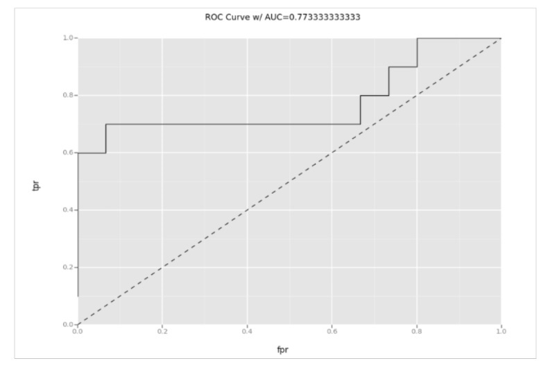

# Image Classification with Microsoft AI Platform
## Summary
Image classification is among the most popular applications of deep learning. For example, the insurance company can classify the car accidents based on the photo of the damaged part and make decision whether the claim is valid or not. For manufacturing factories, they may inspect whether there is defect in the product based on the images. For this project, we will use the images from the parts of the vehicle to judge whether there is a defect with it, such as dents or scratches on the surface. Microsoft’s Azure cloud ecosystem provides the scalable, elastic and intelligent AI platform. We will demonstrate how to develop the end to end AI solution with Azure AI platform. The solution will include:

- Image processing: process the images for feature extraction;
- Deep learning model: building a CNN (Convolutional Neural Networks);
- Model training: show how to create a CNN to train the model;
- Transfer learning: using pre-trained deep learning model to fine tune the new model;
- Deploy the model as a web service: demonstrate how to deploy the trained model as a web service;
- Consume the web service: How to invoke the model;
- PowerBI dashboard: building a dashboard to track the performance 

## Steps
In the following, we will go through each step with detailed instructions to illustrate the end to end solution development process.
### Step 0: Prepare the Azure DSVM

In the [Azure Portal](https://ms.portal.azure.com), begin provisioning a new Windows 2016 DSVM.
It may take 15 to 20 minutes for VM deployment

### Step 1: Label the image
Image classification is the same as the common classificaiton problem. First we need label the data. We mark the center of the dents in the images. Then cut off the 64X64 around the center of the blob. This one will be labeld as '1'. For the rest of the images, we will cut 64X64 images randomly and label them as '0'. The following picture showed the result of this process:

### Step 2: Data Augmentation
Even with the image processed as before, still we have too few images for training (< 100). We need expand our dataset for a better model. Data Augmentation can always improve performance though the amount depends on the dataset. If you want to augmented the data to artificially increase the size of the dataset you can do the following if the case applies (it wouldn't apply if for example were images of houses or people where if you rotate them 180degrees they would lose all information but not if you flip them like a mirror does):

- rotation: random with angle between 0° and 360° (uniform)
- translation: random with shift between -10 and 10 pixels (uniform)
- rescaling: random with scale factor between 1/1.6 and 1.6 (log-uniform)
- flipping: yes or no (bernoulli)
- shearing: random with angle between -20° and 20° (uniform)
- stretching: random with stretch factor between 1/1.3 and 1.3 (log-uniform)
- mirroring: get the mirror of the original image

In our approach, we will rotate each images in every 15 degree, and then take the mirror of each image in horizontal and vertical directions. So for each image, we will generate 24 (rotated including the original one) * 2 (mirrored) = 48 images. The following picture illustrates the processing:

### Step 4.1: Build model from scratch
We will use the Keras as example to show the model building process. Keras supports both CNTK and Tensorflow as the backend.
The problem we try to solve is verify whether there is a dent in the given image, which is a simply binary classification problem. Here we build a feed-forward convolutional neural network (CNN), which performs quite well for this kind of classification problem. The following picture illustrates the workflow of the training process.

### Step 4.2: Transfer Learning
Given the small number of images we have, instead of training the model from the scratch, we may take advantage of pre-trained model. In general, the most important factors to decide how to perform transfer learning are the size of the new dataset (small or large) and the similarity with the original dataset. For our case, we will use the pre-trained mode with VGG as example to demonstrate the usage of transfer learning. Since the dataset is small, we will only train a linear classifier. Because the dataset is very different compared with the ImageNet images, we will train a classifier from activations somewhere earlier in the VGG network.  
 
VGG is a deep convolutional network for object recognition developed and trained by Oxford's renowned Visual Geometry Group (VGG). They achieved very good performance on the ImageNet dataset.

### Step 5: Model Performance Evaluation
We randomly chose 11 images for model performance evaluation purpose. With the image augmentation, we will have 25 test images of size 64 X 64, 11 with positive labels and 14 with negative ones.
For the model trained from the scratch, the performance metrics is as following:
 &nbsp;&nbsp;&nbsp;<b>Precision:</b>  1.0
 &nbsp;&nbsp;&nbsp;<b>Recall &nbsp;&nbsp;&nbsp;&nbsp;&nbsp;:</b> 0.6
 &nbsp;&nbsp;&nbsp;<b>F1 score :</b> 0.75
 &nbsp;&nbsp;&nbsp;<b>AUC &nbsp;&nbsp;&nbsp;&nbsp;&nbsp;&nbsp;&nbsp;&nbsp;:</b> 0.77

The ROC curve is as following:
 

 The performance metrics for VGG16 transfer learning is as following:
 &nbsp;&nbsp;&nbsp;<b>Precision:</b>  1.0
 &nbsp;&nbsp;&nbsp;<b>Recall &nbsp;&nbsp;&nbsp;&nbsp;&nbsp;:</b> 0.6
 &nbsp;&nbsp;&nbsp;<b>F1 score :</b> 0.75
 &nbsp;&nbsp;&nbsp;<b>AUC &nbsp;&nbsp;&nbsp;&nbsp;&nbsp;&nbsp;&nbsp;&nbsp;:</b> 0.91

The ROC curve is as following:
 

With the transfer learning, it will get the better performance with relatively small amount of training images.
### Step 6: Model deployment and scoring
We selected the transfer learning model to deploy as the web service via Azure Webapp. 

##Learnings and Challenges
The most challenge of the project is the limited number of images. This is a common problem: how to improve the performance of the deep learning model with small dataset? There are two ways to solve the problem. Either try to enlarge the dataset through the data augmentation or using transfer learning to fine tune the pre-trained model with the limited dataset.  

In practice, very few cases there are large enough dataset to train the deep learning network from scratch. The transfer learning gains popularity recently. You can leverage the pre-trained model to save time on determining the topology of the network, thousands of hyper parameters and tons of time in training time. Through this project we tried and compared some popular CNN pre-trained models and found that it performed better than the built from scratch network and simplified the model development process.

Another challenge we faced is the development toolset and the model operationalization. We need identify the necessary tools and platforms to use. It seemed the Azure Data Science Virtual Machine(DSVM) is great in helping the customer to ramp up on AI project. It contains most of the common tools for data exploration, modeling and development activities. The Tensorflow and Cognitive Toolkit are pre-installed and we can easily setup the Jupyter Notebook for AI model development. After the model is trained, how to deploy it into the production is a challenge to the data scientist. Thanks to Azure Web Apps service that provide us the way of publish the deep learning model as a web application which can be easily consumed. It provides the built-in autoscale and load balancing that can fit well for our scenario. The continuous deployment with Git, Team Foundation Server, Github and VSTS makes the model retrain and re-deploy much easier.    
