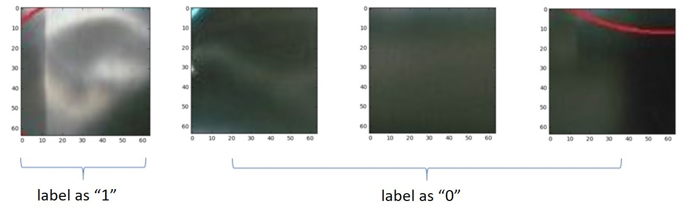

# 基于Azure人工智能平台实现图像分类 [English](README-EN.md)

在下面的内容中，我们会针对本方案的端到端开发流程，按步骤进行详细说明。

## 步骤 0: 准备好Azure 数据科学虚拟机(DSVM)
建议参考 *Depoy\TrainingDSVM* 创建、部署和配置DSVM.
你也可以直接在[Azure 门户](https://portal.azure.cn/)中创建 DSVM，然后按照需要自己配置。

## 步骤 1: 数据预处理
图像分类和一般的分类问题一样。首先我们需要标注数据。在本方案中，我们采集到原始数据后，在凹陷的中心点进行了标记。所以输入数据包括了*Train* 文件夹，包含原始图片，以及 *Train_dotted* 文件夹，包含标记过的图片。示例数据位于*Data/Images*。同理对于测试集，也包含有*Test*文件和*Test_dotted*文件夹。

基于这样的数集，我们用预处理代码来自动切出64*64大小图片。以标记点为中心切出的图片就标记为"1"。在其他位置随机切出的图片就标记为"0"。下图就是对处理后图片的一个示例：

## 步骤 2: 数据增强
尽管进行了上一步的数据处理，我们的训练数据还是很少(< 100)。为了得到更好的模型，我们需要扩大数据集。一般来说，数据增强总是可以提高性能的，能提高多少收到数据集的影响。
如果你想人工增强数据，一般有如下这些操作：(不是所有的数据集都可以试用于所有方法)
- 旋转: 随机旋转角度 0° 到 360°
- 平移变化：随机变化-10 到10 像素
- 尺度变换: 随机缩放 1/1.6 到 1.6
- 翻转: 是或否 
- 裁剪: 随机裁剪角度-20° 到 20°
- 拉伸: 随机拉伸 1/1.3 到 1.3 
- 镜像: 得到原始图片的镜像

在本方案中，我们对每个图片进行15度的旋转，水平镜像和垂直镜像。因此对于一张图片，我们会生成 24 （旋转，包含原始的） * 2（镜像） = 48 张. 下图示例了数据增强的过程:

## 步骤 3.1: 从头开始构建模型
我们使用 Keras 来实现构建模型的过程。Keras 既支持 CNTK (Cognitive Toolkit) 也支持 Tensorflow 作为它的后端。
我们要解决的问题是判给定的图片上是否有凹陷，所以这是一个二分类问题。因此我们可以构建一个前向卷积神经网络模型（CNN）。CNN 在图像分类问题上有很好的表现。下图是我们构建的 CNN 模型的结构图：

## 步骤 3.2: 迁移学习
鉴于我们的图片数量很小，我们可以利用预先训练好的模型来取得更好的效果。而不是从头开始构建新模型。一般来说，判断是否应该进行迁移学习的标准是数据集的大小以及新数据集和原始训练数据之间的相似性。在本方案中，我们使用预先训练好的 VGG 模式来示例迁移学习的使用。
因为我们的数据集很小，所以这里我们还是使用线性分类器（全连接层）。 又因为我们的数据集和VGG原始的数据集ImageNet差别比较大，我们会从网络层次比较早的位置开始训练。 
 
VGG 是由牛津大学著名的 Visual Geometry Group (VGG) 开发和训练的物体识别CNN，在ILSVRC 2014 时，在ImageNet数据集上取得很好的效果。

## 步骤 4: 模型性能评价
我们随机选取11张图片进行模型性能评估。通过图片增强，一共是25个数据，11标记为1，14个标记为0.

对于从头开始构建的模型，性能指标如下所示：

 |指标|结果|
 | - | - |
 |准确率|1.0|
 |召回率|0.6|
 |F1|0.75|
 |AUC|0.72|

The ROC 曲线如下图所示:

 

对于从 VGG16 迁移学习的模型，性能指标如下所示：
 
 |指标|结果|
 | - | - |
 |准确率|1.0|
 |召回率|0.6|
 |F1|0.75|
 |AUC|0.91|

The ROC 曲线如下图所示:

 

可以看出，使用了迁移学习的后可以得到更好的性能。

## 步骤 5: 模型部署和使用
我们使用Azure Web应用来部署模型，通过网络服务来使用模型。
参考 *Deploy\PredictWebApps* 进行模型部署和使用。
