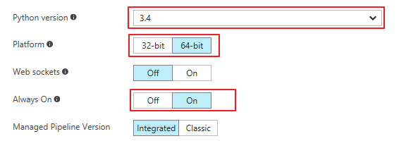
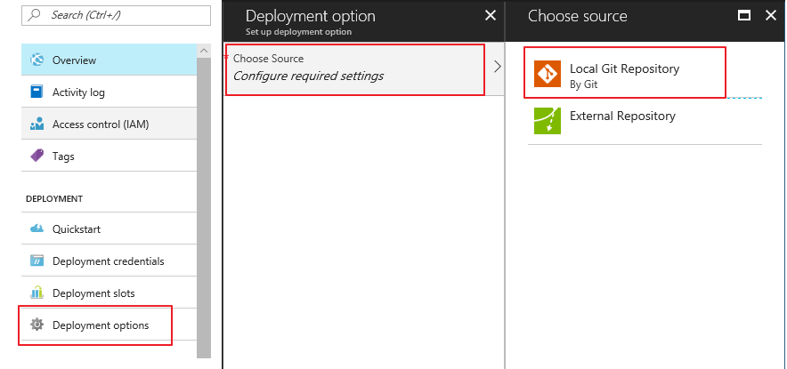

# How to deploy PredictWebApps [中文](README.md)
As our Architecure shows as following, there are two pipelines:
1. Training Pipeline
2. Inference Pipeline


PredictWebApps is focus on inferecne pipline.
Following these deploy steps, you wiil create an WebApps with a sample web page.
The web page looks like following:

 

You can upload an image to try this predict API. Or take this web page as reference, call web api from any client your want. 

In this folder already contains model files saved from Training Pipline. If you want to update model, refer [How to update model](#optional-how-to-update-model).
## How to deploy

### Prerequisite
You should have following prerequisites:
1. An subscription of [China Azure](https://www.azure.cn/) 
2. Git client

### Deploy steps
1. Create a Web App using any way you like, Powershell, Azure cli or just on Portal.
2. Configure Web App to install neccessary python version. 
    + Navigate to your web app on [Azure Portal](https://portal.azure.cn/), scroll down to "Application Settings", set Python "Platform" to "64-bit", and set "Always On" to "On", choose "Python version" to "3.4". Click "Save".

    

    + Scroll down to the "Extensions" blade, then click on "Add", locate "Python 3.5.4 x64" and add it. (you must use this extension). Wait for installed successfully.

3. Enable git deployment and set username and poassword. 
    + Navigate to "Deployment options" blade, "Choose Source", choose "Local Git Repository" and Save.

    

    + Navitgate to "Deployment credentials" blade, set deployment username and password.

4. In this folder *PredictWebApps*, create a git repo, check in code and push to remote, to deploy.<PASTE_URL_GIT_REMOTE> is from your web app portal "Overview" blade.
``` git
# Initialize your git repo
git init

# Add the azure endpoint
git remote add azure <PASTE_URL_GIT_REMOTE>

git add -A
git commit -m "init"
git push azure master

```
If a window pop up, input the username and password you set in preview step.

5. After installing all dependence successfully and deloying successfully, you can go to web site to see the result. Attention, the first time after deploying will take minutes to load model and libraries.


## (Optional) How to update model
If you have trained a new model, you just need to replace the model files update *Model*, git put the new code to Azure web app. If the model files name changed, you should also change it in *WebApp/model.py*.