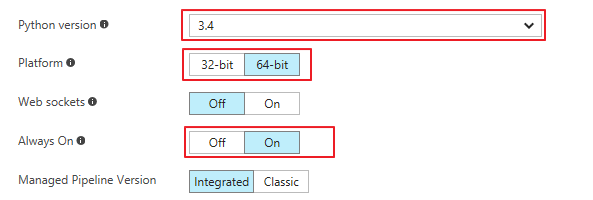
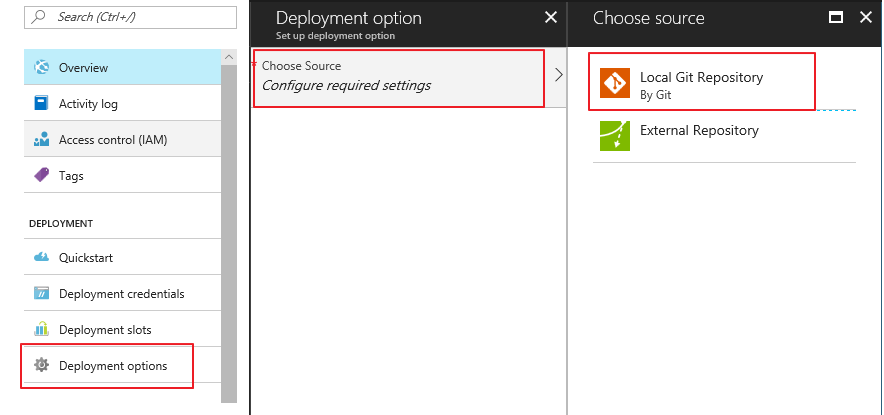

# 如何部署 PredictWebApps [English](README-EN.md)

本解决方案包括两个流程：
1. 训练流程
2. 部署流程

**PredictWebApps** 对应于部署流程。按照文档部署后，会在你的Azure订阅创建一个 Web 应用，网页如下图所示：

 

用户可以通过上传图片试用这个预测的 API, 也可以参考这个网页从任意客户端调用 API。

本示例方案中包含了从训练流程中训练出来的模型文件。 更新模型可以参考[更新模型](#可选-更新模型)。

## 如何部署

### 部署前提
要进行本解决方案的部署，必须具备如下的资源和条件：
1. Azure 中国的[订阅账号](https://www.azure.cn/)
2. Git 客户端软件

### 部署步骤
1. 创建一个 web 应用。可以使用任何方式，比如 Powershell, Azure Cli 或者 Azure 门户。
2. 在 web 应用中安装配置python版本
    + 在 [Azure 门户](https://portal.azure.cn/)中打开这个 web 应用，打开 "Application Settings"， 把 python "Platform" 设置为 "64-bit", "Always On" 设为 "On", "Python version" 改为 "3.4"，保存。

    

    + 打开 "Extensions"， 点击 "Add", 找到 **"Python 3.5.4 x64"**, 添加安装。**你必须使用这个版本的扩展**。 等待安装成功。 如果安装失败了就再添加一次。

3. 设置为 git 部署，并且设置用户名和密码。
    + 打开 "Deployment options" , 点击 "Choose Source", 点击 "Local Git Repository"， 保存。

    

    + 打开 "Deployment credentials", 设置用户名密码，保存。

4. 在当前的目录下( *PredictWebApps* ), 创建一个 git 仓库， 提交代码，推送到远端进行部署。

<PASTE_URL_GIT_REMOTE> 可以从 Web 应用的 "Overview" 里面找到.
``` git
# Initialize your git repo
git init

# Add the azure endpoint
git remote add azure <PASTE_URL_GIT_REMOTE>

git add -A
git commit -m "init"
git push azure master

```
当对话弹出时，输入之前设置的用户名密码。

5. 当部署安装成功后，就可以访问 web 地址查看网页了。第一次打开网页会花费几分钟的时间。

## (可选) 更新模型
示例程序中已经包含了之前训练好的模型文件，如果想更新模型，只需要拷贝模型文件到 *Model* 目录下, 使用git推送到远端 (参考上一步骤的 git 代码)。如果模型文件的文件名修改了，需要修改代码 *WebApp/model.py*。