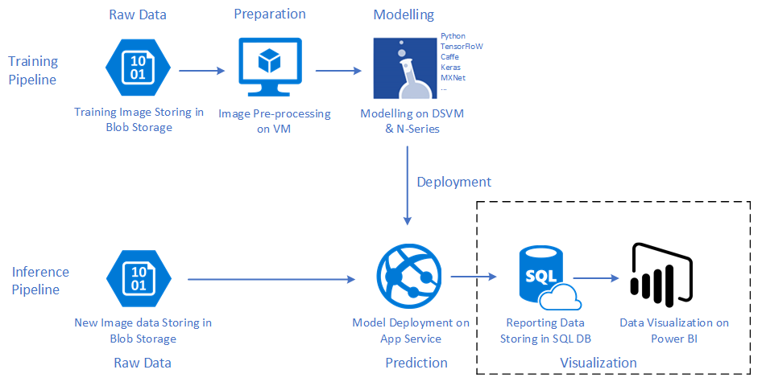

# Deploy this solution to your subscription [中文](README.md)
We provide a deploy package here to help you deploy this solution to your subscription.

As our Architecure shows as following, there are two pipelines:
1. Training Pipeline
2. Inference Pipeline

It contains two folders here, which map to these two pipelines. Black box in above achiteture not included here.
**TrainingDSVM** is mapping to traning pipline. 
Using these deploy scripts, you can create an Data Science Virtual Machine ( DSVM ) in your subscription. 
All dependencs will installed automaticly. Code will be copied into this DSVM as well. You can explore sample code and data in Jupyter Notebook just after deployment.

**PredictWebApps** is mapping to inferecne pipline.
Following these deploy steps, you can create an WebApps with a sample web page and build-in model fiels.
The web page looks like following:

 

You can upload an image to try this predict API. Or take this web page as reference, call web api from any client your want. 

