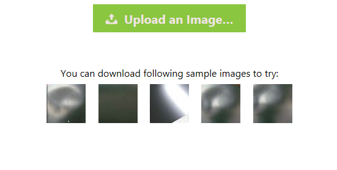

# 部署解决方案 [English](README-EN.md)
本方案提供了可部署在自有Azure订阅的解决方案部署包，通过部署解决方案，用户可以深入了解如何利用Azure云服务实现图像分类的业务场景，并可以通过修改部署包中的样本数据或修改训练代码等快速搭建自己的Demo。

解决方案架构图如下，包括两个流程：
1. 训练流程
2. 部署流程

在本目录下包含两个文件夹，分别是对应于这两个流程的部署包。图中黑框所示的可视化部分不包含在内。

**TrainingDSVM** 对应于训练流程。按照文档部署后，会在你的Azure订阅中自动创建出一个数据科学虚拟机(DSVM)。所有训练需要用到的依工具和依赖包都会自动安装好，代码和样本数据也都会部署在数据科学虚拟机中。在部署完成之后，用户就可以直接在 Jupyter Notebook 中探索代码和数据。

**PredictWebApps** 对应于部署流程。按照文档部署后，会在你的Azure订阅创建一个带模型的 Web 应用，网页如下图所示：

 

用户可以通过上传图片试用这个预测的API, 也可以参考这个网页从任意客户端调用API。

