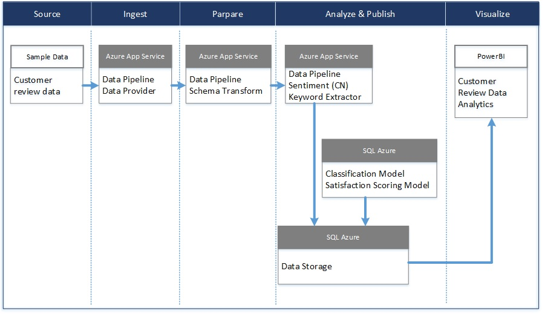

# 顾客评论分析
顾客评论分析解决方案是利用微软自然语言处理技术、Azure云服务及大数据分析技术构建的行业解决方案。
解决方案利用抓取的电商网站上顾客对商品的评论数据，利用标准顾客满意度算法计算商品各维度的顾客满意度分值。

## 场景描述
基于采集的顾客对商品的评论数据，利用文本分类算法、文本情感分析算法等自然语言处理技术，计算商品在不同维度（如：售前、售后、价格、便携性等）的满意度分值。

## 技术架构
解决方案架构图如下：

## [PowerBI演示](./PBI%20Demo)
解决方案提供的PBI Demo包含了分析处理过的数据及基本的业务场景。用户可以基于自己的业务理解，利用分析过的样本数据快速修改PBI demo报告，定制业务数据展现方式，帮助客户深入理解业务场景。

## [部署包](./DeployPkg)
解决方案提供了可部署在自有Azure订阅的解决方案部署包，通过部署解决方案，用户可以深入了解如何利用Azure云服务实现业务场景，并可以通过修改部署包中的样本数据或修改PBI Demo报告来快速搭建自己的Demo。

### 部署前提
要进行顾客评论分析解决方案的部署，必须具备如下的资源和条件
  1. 具有Azure中国的[订阅账号](https://www.azure.cn/)
  2. 订阅账号中包含足够可用的资源配额和权限
     1. 能够创建资源组
     2. 能够创建SQL Azure服务器和数据库以及相关防火墙规则
     3. 能够创建服务计划（Service Plan）和网站应用（Web App）
  3. 具有Power BI订阅用于制作展示报表
  4. 系统安装Azure SDK, Powershell 5.0及PowerBI Desktop

### [部署包组成](./DeployPkg/CRDAnalytics.zip)
部署包CRDAnalytics.zip主要包括以下几个部分：
  1. setup.cmd 用于进行一键自动化部署的主要脚本。
  2. AppServiceHost目录内部是编译发布好的Azure网站应用，提供对顾客评论数据进行分析的主要功能
  3. PsScripts目录内部是自动化部署需要的脚本，其中Settings.ps1中包含默认的演示环境配置信息（资源组名称，数据库用户名、密码等）
  4. SqlScripts目录内部是创建和初始化顾客评论原始数据库的脚本，其中InsertSampleData.sql中是用于演示目的的顾客评论数据

### 部署流程

部署流程包含了在Azure订阅中进行资源创建的过程。完成的创建过程包含了以下步骤。

  1.  进行Azure订阅登录。
  2.  创建资源组。
  3.  创建SQL Azure数据库服务器及数据库。
  4.  初始化数据库。
  5.  插入演示数据。
  6.  创建服务计划以及Web应用。
  7.  将Web应用文件使用FTP的方式上传到Web应用中。
  8.  启动Web应用。
  10. 修改Power BI示例报表文件[Customer Review Data Analytics.pbix](./PBI%20Demo/Customer%20Review%20Data%20Analytics.pbix)中的数据库连接信息。
  11. 发布Power BI报表文件。

### 部署步骤

  1. 下载部署包[CRDAnalytics.zip](./DeployPkg/CRDAnalytics.zip)并解压至本地目录（如 C:\Temp\CRDAnalytics）。
  2. （可选）根据说明修改PsScripts\Settings.ps1中的环境配置信息
  3. （可选）如需替换演示数据可以修改SqlScripts\InsertSampleData.sql中的商品信息和客户评论数据
  3. 运行setup.cmd。
  4. 等待脚本运行，直到部署完成。
  5. 保存脚本输出的数据库连接信息。
  5. 等待演示数据处理完成，此过程大约需要30~60分钟。
  6. 下载Power BI示例报表文件[Customer Review Data Analytics.pbix](./PBI%20Demo/Customer%20Review%20Data%20Analytics.pbix)
  7. 在PowerBI Desktop中打开示例报表文件并修改数据源信息为步骤5种保存的数据库连接信息。
  8. 在PowerBI Desktop中发布示例报表文件。

## [源代码](./src)
解决方案提供了相应的源代码包供用户参考。用户可以通过修改源码来快速搭建及开发基于Azure的定制化的Demo。

源代码主要包含以下几个项目：

  1. [Common](./src/Common)项目主要包含顾客评论数据分析的业务逻辑，此项目中关键目录说明如下：
       * [DataAccess](./src/Common/DataAccess)中是基于Entity Framework的数据库访问层，如需修改顾客评论数据源，需要修改此目录下的数据库实体定义。
       * [Nlp](./src/Common/Nlp)中是自然语言处理相关的服务，本解决方案内置的两个处理模型是情感分析和关键词提取。
       * [Pipeline](./src/Common/Nlp/Pipelines)中是数据处理管道的实现，如需扩展可以在[Activities](./src/Common/Pipelines/Activities)中添加其他分析处理逻辑。
  2. [Deployment](./src/Common)项目包含部署用的PowerShell和SQL脚本，这个工程是一个命令行程序，可以通过添加代码手工测试Common工程的功能。
  3. [AppServiceHost](./src/AppServiceHost)项目是顾客评论数据分析功能的Azure网站应用宿主，对此解决方案源代码修改后需要编译发布此项目并替换部署包中的AppServiceHost目录。