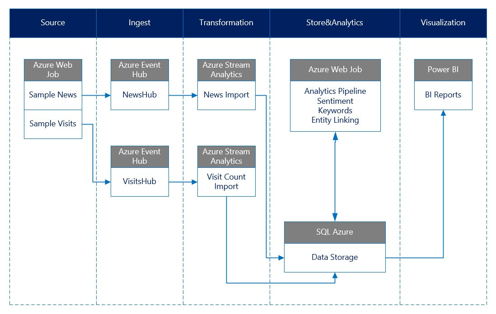

# 舆情洞察解决方案
舆情洞察解决方案是针对媒体行业的需求，利用微软自然语言处理技术、Azure云服务及大数据分析技术构建的行业解决方案。
解决方案利用互联网公开新闻文本数据，分析全球各主要国家及地区的热点新闻事件，持续监控事件趋势，多维度洞察事件影响力，协助媒体机构进行素材采集及选题。

## 场景描述
基于采集的互联网新闻数据，利用文本聚类算法、文本情感分析算法等自然语言处理技术发现热点事件，分析热点事件情感走势，及热点事件的影响力。

## 技术架构
解决方案架构图如下：

解决方案是一个从数据收集到数据展现的完整流程，其中包括了数据收集，数据注入，数据转换，数据存储和分析，以及数据可视化部分。

数据收集部分是一个WebJob，主要用于将示例数据注入到事件中心，示例数据可以根据需要进行更改或者自行生成。
两个事件中心主要用于对收集数据的注入，在实际的场景中，可能有多个数据收集源，这些数据收集者将收集的数据注入到事件中心。
流式分析主要用于将事件中心中的数据导入到数据存储中，在进行数据导入的过程中可以对数据根据业务进行数据变形，连接等相关操作。
数据存储主要用于存储业务数据，存放在SQLAzure 数据库中。
分析工作主要使用WebJob作为后台服务运行进行数据处理操作，WebJob运行分析作业将数据从存储中加载出来，并进行情感分析，关键词提取，实体链接等相关操作，并将分析处理完成的数据存储到数据库中。
数据可视化则主要使用Power BI完成，将Power BI连接到SQL Azure数据源上，根据需要的数据进行报表构建。

## [PowerBI演示](./PBI%20Demo)
解决方案提供的PBI Demo包含了分析处理过的数据及基本的业务场景。用户可以基于自己的业务理解，利用分析过的样本数据快速修改PBI demo报告，定制业务数据展现方式，帮助客户深入理解业务场景。

## [部署包](./DeployPkg)
解决方案提供了可部署在自有Azure订阅的解决方案部署包，通过部署解决方案，用户可以深入了解如何利用Azure云服务实现业务场景，并可以通过修改部署包中的样本数据或修改PBI Demo报告来快速搭建自己的Demo。

### 部署前提
要进行舆情洞察解决方案的部署，必须具备如下的资源和条件
  1. 具有Azure中国的[订阅账号](https://www.azure.cn/)
  2. 订阅账号中包含足够可用的资源配额和权限
     1. 能够创建存储账号（Storage Account）
     2. 能够创建SQL Azure服务器和数据库以及相关防火墙规则
     3. 能够创建服务总线（Service Bus）以及事件中心（Event Hub）
     4. 能够创建服务计划（Service Plan）和网站应用（Web App）
     5. 能够创建流式分析（Stream Analytics）作业
  3. 系统安装Azure SDK及Powershell 5.0
  4. 具有Power BI订阅用于制作展示报表

### [部署包组成]((./DeployPkg))
部署包中主要包含以下几个部分
  1. setupsolution.ps1 用于进行自动化部署的主要脚本。
  2. ASA文件夹中是对应用于进行流式分析作业创建的Azure资源模板（ARM Template）。
  3. EventHub文件中是用于进行事件中心创建的Azure资源模板。
  4. InitDB.sql用于初始化数据库表及索引结构
  5. 需要将源代码中的MediaAnalysisApp发布到该文件夹中的SSCN文件夹下，详细参见[操作步骤](#发布Web应用用于服务部署)

### 发布Web应用用于服务部署

要构建完成的部署包，需要将源代码进行生成发布，作为部署包的部署内容。

  1. 打开源代码工程，选择MediaAnalysisApp工程，点击右键，选择**发布(Publish)**.
  2. 在弹出的页面中, 选择**自定义（Custom）**。点击下一步。
  3. 在接下来的**发布方式**（Publish Method）中选择 **文件系统**。
  4. 打开[部署包](./DeployPkg)文件夹，在该文件夹中新建文件夹**SSCN**。
  5. 在**目标位置**中选取新建的文件夹SSCN作为目标位置
  6. 点击下一步，选择**发布**版本。
  7. 点击**完成**，进行工程的生成和发布。发布完成之后可以在SSCN文件夹中看到完整的网站应用结构文件。

### 部署流程

部署流程包含了在Azure订阅中进行资源创建的过程。完成的创建过程包含了以下步骤。

  1. 进行Azure订阅登录。
  2. 创建事件中心。
  3. 创建SQL Azure数据库服务器及数据库。
  4. 创建和启动流分析作业。
  5. 创建服务计划以及Web应用。
  6. 将Web应用文件使用FTP的方式上传到Web应用中。

### 部署步骤

  1. 打开PowerShell，切换当前文件夹到DeployPkg下面。
  2. 运行setupsolution.ps1。
  3. 在弹出的登录框中输入Azure订阅的用户名和密码，验证登录。
  4. 根据提示，选择部署地点，输入1回车选取为China North， 2回车选取为China East。
  5. 根据提示，输入数据库服务器的用户名，比如azure，sa不能作为该用户名。
  6. 输入数据库服务器密码，需要最短8位，包含大小写字母，数字及特殊字符，如Passw0rd!。
  7. 等待脚本运行，直到部署完成。

部署完成之后，可以登录到Azure Portal中，在资源组中通过SSCN进行筛选，找到对应的资源组进行资源相关信息查看和管理。
可以通过连接对应的数据库，进行数据的查询和结果观察。当数据处理完成后，可以使用Power BI连接数据库进行报表的制作。

## [源代码](./src)
解决方案提供了相应的源代码包供用户参考。用户可以通过修改源码来快速搭建及开发基于Azure的定制化的Demo。通过使用Visual Studio打开\src\MediaAnalysisService\MediaAnalysisService.sln文件可以打开工程。

源代码主要包含以下几个工程
  1. DataAccess 工程，主要用于数据库连接和实体关系映射。
  2. MediaAnalysis 工程，主要包含了分析作业的相关逻辑。
  3. NLPLib，主要包含了文本处理的相关逻辑。
  4. DataCollectingJob，这是一个WebJob工程，主要用于模拟数据的收集
  5. NewsTextAnalysisJob, 一个WebJob工程，主要用于新闻文本分析作业的执行。
  6. MediaAnalysisApp,用于发布到Azure网站应用的工程，WebJob将随该工程进行发布并运行。系统的部署也需要先将该工程进行发布，形成整体的部署包。
