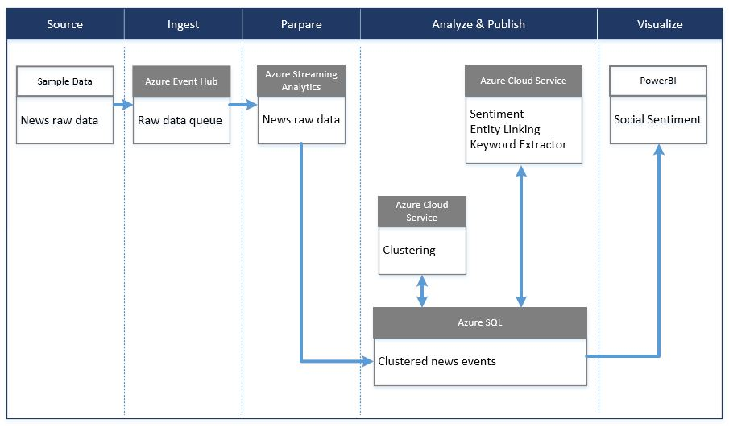

# Social Sentiment Solution (EN)
Social sentiment analytics solution targets typical scenarios of media industry, leveraging published internet new contents and NLP, big data analysis technologies and Azure services to analyze 
* hot events allover the world
* trend of social sentiment
* impact of social enents with multi dimissions

## scenarios
Leveraging crawled news contents from internet, clustering and sentiment analysis algorithms, editors of media industry can understand the hot events of countries allover the world and their sentiment, then make the programs based on analysis reports.

## Solution architect
Diagram of solution architect：

## [PowerBI Demo](./PBI%20Demo)
PowerBI demo includes PBI reports for basic business scenarios with embedded cooked data. Reports can be customized by customers for their specific requirements on business scenarios.

## Deploy Package
Deploy package can be deploy to customer's Azure subscription. Customer can better understand the services and pipeline via deployed solution, even they can build customized PoC and demo via data source replacement and PBI reports update.
The deploy package is under developing, please refer to the package for Chinese solution.

## Source Code
Source code packages are provided to customers to help them quick building their owned solution.
The source code package is under packaging, please refer to the package for Chinese solution.
