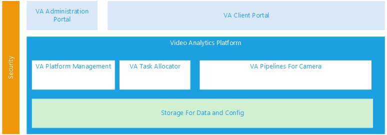

# Video Analytics Platform

Video analytics is key to enabling a wide range of horizontal scenarios that are relevant for various vertical industries.  The most popular domains of application include people identification, crime detection, workplace safety awareness, human and traffic flow management.

There are quite a few differnt scenarios that can benifit from the video analytics platform just like the following: 

**Workplace safety**: cameras to monitor compliance at its industrial sites. Employees not wearing hard hats at the monitored sites will trigger violation events and the supervisor can take corrective actions.

**Traffic monitoring**: managing highway and road safety in real time, such as malfunction or suspicious vehicles that have vied off and stopped at the shoulder of congested and busy highways. 

**Public safety**: law enforcement agencies around the world are increasing public infrastructure spending on security cameras in public spaces to monitor suspicious behavior and individuals. 

In the last decade, IP capable cameras have helped simplify network connection and deployment of video cameras. Video storage and archival has also been simplified through special purpose NVR (network video recorders) hardware that are often deployed on-premises. The IO-intensive nature of video traffic limits the number of cameras that can connect to a single NVR and the kind of advanced processing (e.g. image recognition) that the NVR can undertake. 

Last few years we are beginning to see video cams equipped with advanced capabilities, including those with real time image recognition capabilities. This has allowed real time video processing to move to the extreme edge, alleviating the need for cameras deployed in public spaces to transmit large volume of video across WAN infrastructure.  

However, many advanced camera systems are usually closed black box system, making it difficult for enterprise customers to extend the image recognition capabilities to support new scenarios and integrate with existing monitoring, alerting and incident response systems. It is usually difficult to update the algorithms in closed box systems to take advantage of fast improvements in latest state of the art computer vision technology. Compared to commodity cameras, closed systems is also more expensive and can lock-in the customers with specific vendor.

**[Azure IoT Edge](https://docs.microsoft.com/en-us/azure/iot-edge/how-iot-edge-works "Azure IoT Edge")** moves cloud analytics and custom business logic to devices so that your organization can focus on business insights instead of data management. Enable your solution to truly scale by configuring your IoT software, deploying it to devices via standard containers, and monitoring it all from the cloud.

With Azure IoT Edge, we can leverage Azure IoT Hub and Edge to build a Video Analytics Platform which is open for extending and easily to be adopted in Local LAN system to process video analytics. 

A Video Analytics Platform contains the following components: 

The architecture with IoT edge devices will be like the following: 

 
